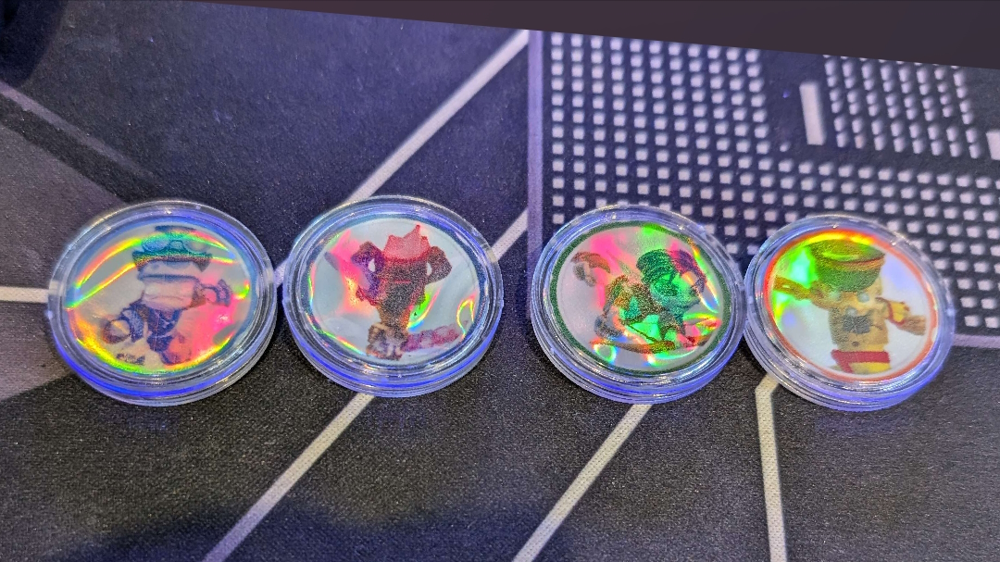
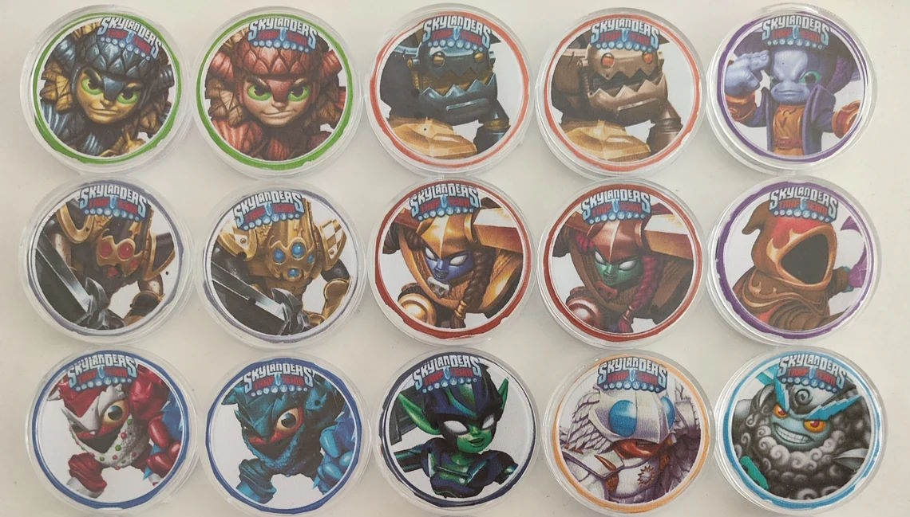

# Skylanders Coin Cards Printing

## Holographic Paper Example

## Normal Paper Example

---

Original idea and implementation was provided by Shizzy (@shizzy._.)

You can find the round image assets in the [Skylanders Image Generator](https://skylandersnfc.github.io/Skylanders-Image-Generator/) (Coins Generator).

---

Coin Cards: [https://www.aliexpress.com/item/1005006274726431.html](https://www.aliexpress.com/item/1005006274726431.html)

Capsules (25mm): [https://www.aliexpress.com/item/1005005581159030.html](https://www.aliexpress.com/item/1005005581159030.html)

Printing Paper (Holographic): [https://www.aliexpress.com/item/1005005848683360.html](https://www.aliexpress.com/item/1005005848683360.html)

---
