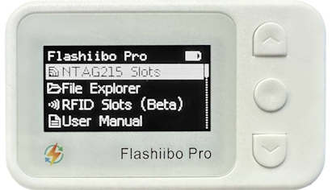

#  Skylanders on Flashiibo Pro (Unofficial Support)

## What is Flashiibo Pro

[https://www.flashiibo.com](https://www.flashiibo.com)

## Where to get Flashiibo Pro

[https://www.amazon.com/dp/B0CQWRPJL2](https://www.amazon.com/dp/B0CQWRPJL2)

## Introduction

Flashiibo Pro’s main purpose is to emulate NTAG215 which is the NFC technology amiibo figures use. However, it’s capable of emulating other NFC/RFID technologies.

For example, it’s also capable of emulating MiFare Classic 1K, the NFC/RFID technology Skylanders use. You may follow the following instructions to emulate Skylanders.

## Install the Unofficial Firmware

Make sure you are on firmware version 46p or later. See firmware upgrade instructions [here](https://www.flashiibo.com/manual/pro/firmware).

## Upload Skylander Dumps

You can do this via the [https://protools.flashiibo.com](https://protools.flashiibo.com) website using a computer or laptop with Bluetooth.

01. On your Flashiibo Pro device with the unofficial firmware installed, navigate to the “Card Emulation” menu.
    
    - If it’s your first time accessing this menu, it may take a while to initialize.
    - The device will also create a “chameleon” folder with two subfolders: “dumps” and “slots”.
02. Return to the main menu and select the “User Manual” option.
03. Open [https://protools.flashiibo.com](https://protools.flashiibo.com) and connect it to your Flashiibo Pro device.
04. Click the “Refresh” button, and you should see “E:/ \[External Flash]” storage appears.
05. Inside this storage, locate the “chameleon” folder and its “dumps” subfolder.
    
    - These were automatically created in Step 1 when the “RFID Slots (Beta)” menu was initialized.
    - If you skipped Step 1, you can manually create these folders.
06. In the “chameleon/dumps” folder, click the blue “Upload” button.
07. Select the desired dumps from the [Skylanders Ultimate NFC Pack](https://skylandersnfc.github.io/Skylanders-Ultimate-NFC-Pack/).
    
    - You can upload multiple dumps, but avoid uploading more than 20 at once or having too many dumps in this directory.
08. The upload popup window can be a bit tricky.
    
    - Wait for all the dumps to upload, indicated by a green check mark on the right.
09. Once complete, close the window.
    
    - You’ll get a warning message, simply confirm by clicking OK.
10. All your uploaded dumps should now appear in the “chameleon/dumps” folder.

## Emulate Skylander Dumps

1. On your Flashiibo Pro device, go to the “Card Emulator” menu.
2. You can use any slot you like, but for the sake of this Tutorial, slot 1 is used as an example.
3. Select “Slot 01”, then go to “Type” and make sure “Mifare 1k” is the type of this slot.
4. Navigate to “Data…”, then “Load…”.
5. Select a Skylander dump from the “chameleon/dumps” folder and you should see “Load File Success”.
   
   - If you want to play on Nintendo Switch, go down to “Advanced…” and set “Custom Mode” to “\[ON]”
   - This will change the SAK from 81 to 08 which is important for Nintendo Switch to recognize the skylander.
6. That’s it! You don’t need to adjust anything else. Simply return to “\[Tag Details]” menu.
7. You should now see your Skylander’s name followed by “.dump”.
   
   - This is the emulation screen, and your Flashiibo Pro device will now emulate the selected Skylander.
   - To use a different Skylander, select a different slot and repeat the steps.
   - The current card emulation limit is 8 slots, but this may be expanded in the future.
8. Place your Flashiibo Pro device on the Portal of Power to bring the selected Skylander into the game.
   
    - The device will also automatically save character progress, gold, and so on.
    - Keep in mind, however, that the game doesn’t save data instantly.
    - Here’s a list of when data is written to the tag:
    - 30 seconds have passed since the last write
    - A Skylander gains a level
    - 100 gold pieces have been collected by a Skylander
    - A Skylander gets a skill upgrade
    - The currently equipped Hat or Trinket equipped by a Skylander is changed
    - The owner of a Skylander is changed
    - The nickname of a Skylander is changed
    - A Skylander is reset
    - A Skylander is placed on a portal for the first time
    - A Skylander gets a stat boost after completing a challenge
